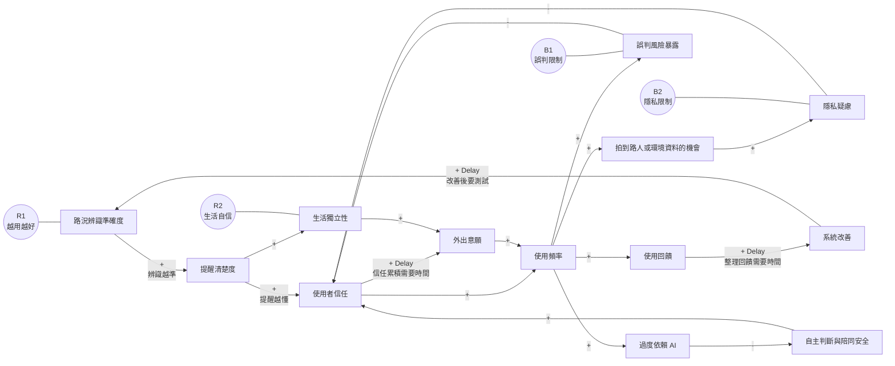

# 智慧眼鏡科技對生活的因果關係圖

這張圖不是一般流程圖，而是系統思考常用的「因果回饋圖」。

## 圖例

- `+`：正相關。A 增加，B 也增加；A 減少，B 也減少。
- `-`：負相關。A 增加，B 減少；A 減少，B 增加。
- `Delay`：時間延遲。影響不會立刻出現，需要一段時間。
- `R`：強化迴路，變化會越來越明顯。
- `B`：平衡迴路，會限制或拉回系統。

## Mermaid 版本

## R1 強化迴路：越用越好

路況辨識準確度 `+` -> 提醒清楚度 `+` -> 使用者信任 `+` -> 使用頻率 `+` -> 使用回饋 `+` -> 系統改善 `+` -> 路況辨識準確度

意思：
如果 AI 判斷越準，提醒就越清楚。提醒越清楚，使用者越信任，也越願意使用。使用越多，開發者越能收集回饋，系統就更有機會改善。

時間延遲：
使用回饋不會馬上變成系統改善；改善後也需要測試，才會真的提升辨識準確度。

## R2 強化迴路：生活自信

提醒清楚度 `+` -> 生活獨立性 `+` -> 外出意願 `+` -> 使用頻率 `+` -> 使用回饋 `+` -> 系統改善

意思：
如果提醒夠清楚，使用者可能更有安全感，也更願意外出。這會增加使用機會，讓系統得到更多回饋。

時間延遲：
信任和外出意願通常不是立刻增加，而是需要多次成功經驗慢慢累積。

## B1 平衡迴路：誤判限制

使用頻率 `+` -> 誤判風險暴露 `+` -> 使用者信任 `-` -> 使用頻率

意思：
用得越多，就越可能遇到 AI 判斷不準的情況。如果使用者覺得系統不可靠，信任會下降，使用頻率也會下降。

## B2 平衡迴路：隱私限制

使用頻率 `+` -> 拍到路人或環境資料的機會 `+` -> 隱私疑慮 `+` -> 使用者信任 `-` -> 使用頻率

意思：
智慧眼鏡越常拍照，就越需要注意路人隱私。如果隱私疑慮升高，使用者或周圍的人可能會比較不放心，進而降低使用意願。

## 給國中生的簡單解釋

這張圖想說明：科技不是只有「做出來」就好。它會和人的信任、生活習慣、安全感、隱私問題互相影響。

如果系統越準，大家越信任，就會越常使用，系統也可能越改越好。這是好的循環。

但如果 AI 常常誤判，或大家擔心被拍到，信任就會下降，使用也會減少。這是限制科技推廣的循環。
