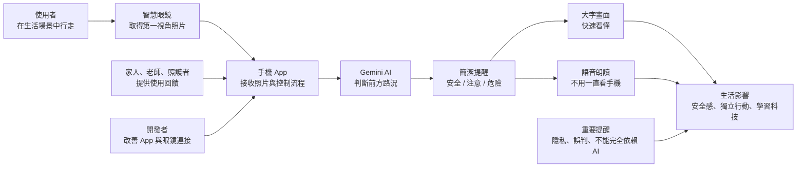

# 智慧眼鏡科技對生活的系統關係圖

這張圖可以放進簡報中，用來說明智慧眼鏡不是單獨工作的裝置，而是連接「人、手機、AI、生活環境、照護與社會」的系統。

## 簡化說法

智慧眼鏡像是「看見前方」，手機 App 像是「整理資料」，Gemini AI 像是「判斷路況」，最後用大字與語音把結果告訴使用者。

## 圖中每個角色的意思

- 使用者：真正走在路上的人，需要簡短、即時、清楚的提醒。
- 智慧眼鏡：取得第一視角照片。
- 手機 App：接收照片、送出 AI 分析、顯示結果、朗讀提醒。
- Gemini AI：根據照片判斷前方是否安全。
- 家人、老師、照護者：協助確認提醒是否真的有幫助。
- 開發者：改善系統穩定度與安全性。
- 生活影響：提升安全感、協助獨立行動，也讓學生理解科技如何服務生活。
- 重要提醒：AI 可能誤判，也要注意隱私，所以不能把它當成唯一判斷來源。
